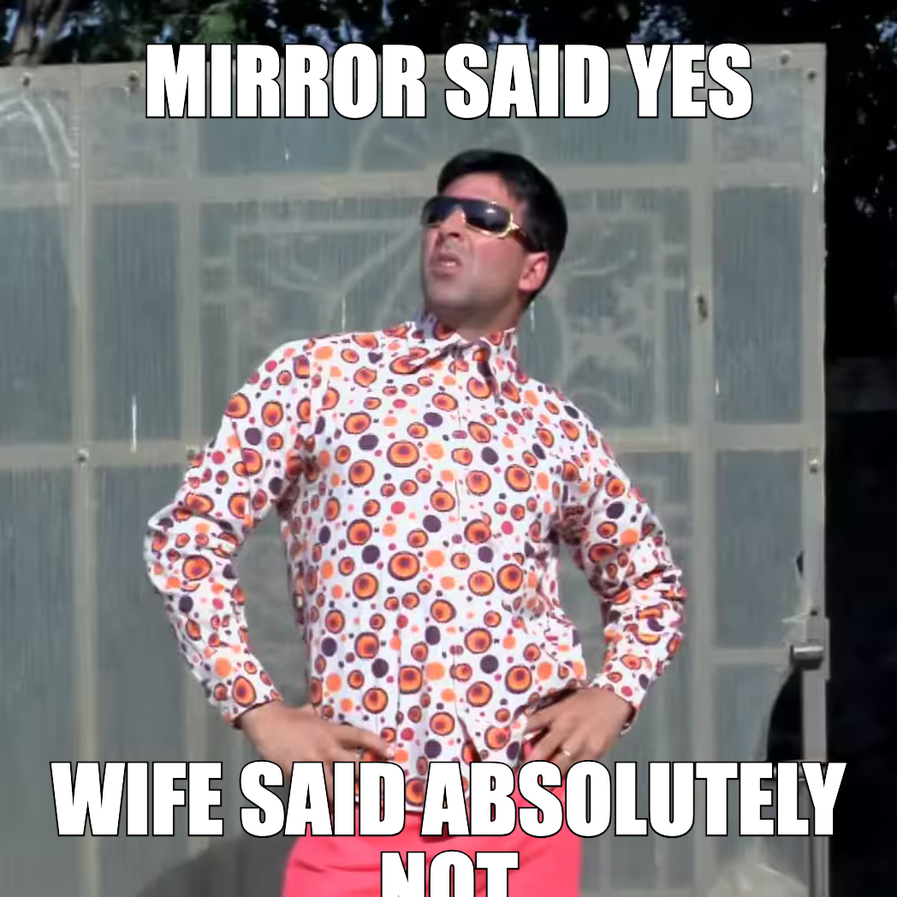

# Magic Memes

Turn one photo into six memes. Pick one, tweak it, share it, watch reactions roll in live.

## Example output

| Stickers — emoji match photo + joke                   | Classic Impact — setup/punchline                     |
| ----------------------------------------------------- | ---------------------------------------------------- |
|  |  |

| BG Swap — subject teleported to a new scene           | Classic Impact — burger expectations vs reality       |
| ----------------------------------------------------- | ----------------------------------------------------- |
|  |  |

## What it does

1. **Upload a photo.** Drag-drop, webcam, or paste from clipboard.
2. **Vision LLM reads the photo** and writes six meme captions — one per format — anchored on what's actually in the picture (expression, outfit, objects, setting).
3. **Pick a format** from six live previews:
   - **Lucky** — chaotic remix via image generation
   - **Classic** — Impact-font top/bottom text
   - **Deepfried** — over-saturated, unhinged energy
   - **BG Swap** — same subject, absurd new backdrop
   - **Stickers** — caption + emoji that match the photo and the joke
   - **Remix** — portable caption to slap on another meme
4. **Edit on canvas.** Drag text, resize, recolor, change font size — all per-text. Switch formats without losing edits.
5. **Share via link.** Flattened PNG goes to Vercel Blob. Share URL renders the meme at `/m/<id>`.
6. **Live reactions.** Viewers tap one of six emoji (laugh / fire / mind / cry / skull / heart). The creator's share page polls and floats emoji animations across the meme for each new reaction.

## Stack

- **React 19 + Vite** with TanStack Router
- **TypeScript** end-to-end
- **Tailwind v4 + shadcn/ui + Radix**
- **Konva** for the canvas editor
- **OpenRouter** for the vision LLM (Claude) and image generation (Gemini)
- **Vercel Blob** for image storage and append-only reaction events
- Deployed on **Vercel** with serverless API routes under `/api`

## Local setup

```bash
npm install
cp .env.example .env.local   # then fill in the keys below
npm run dev
```

Required env vars:

- `VITE_OPEN_ROUTER_API_KEY` — vision + image-gen calls
- `BLOB_READ_WRITE_TOKEN` — Vercel Blob storage (used by `/api/*` routes)

## Project layout

```
src/
  api/             OpenRouter + share + storage clients
  components/      meme-canvas-editor, meme-preview, shared-view, upload-dialog…
  routes/          TanStack Router file routes (/, /upload, /leaderboard, /m/$id)
api/               Vercel serverless functions (upload, react, meme, memes)
public/            static assets
```

## Scripts

- `npm run dev` — local Vite dev server with `/api/*` mounted
- `npm run build` — type-check then production build
- `npm run lint` — ESLint
- `npm run preview` — preview the production build locally
